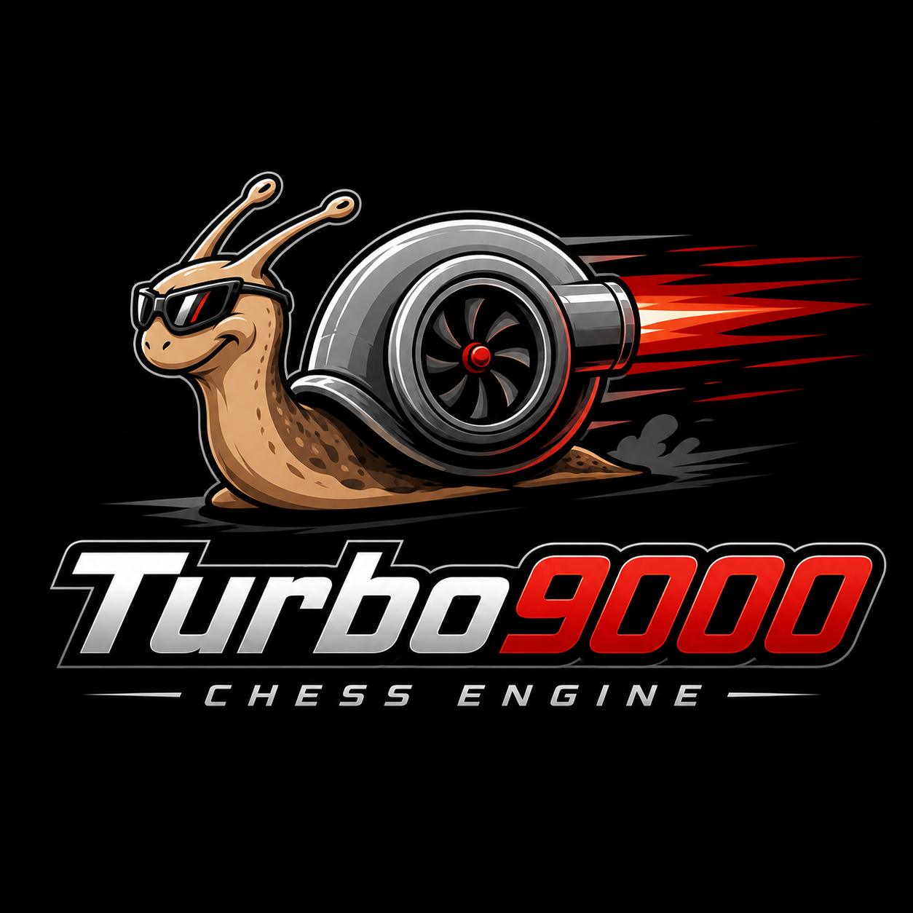

# Turbo9000
A terrible chess engine written in Rust.

## Play against Turbo9000
Turbo9000 has just enough support for UCI and can be played on any GUI that speaks it, for example knights.

    cargo build --release

Add `target/release/turbo9000` as a UCI engine.

`.cargo/config.toml` builds for the host CPU, which can give a performance boost
but the binary is build for the machine. Set `RUSTFLAGS` to override this.

## Testing
Games are played with fastchess against a baseline revision:

      git submodule update --init
      make -C external/fastchess -j
      tools/sprt.sh

Without a baseline-ref, `tools/sprt.sh` tests against the newest version tag
(`v*`). To test against a specific revision pass it explicitly, e.g.:

      tools/sprt.sh HEAD~1
      tools/sprt.sh v0.1.0

SPRT uses a pre generated opening book `books/turbo.epd`.
An opening book can be generated by:

      cargo run --release --bin bookgen -- books/turbo.epd 30000

## Versioning
The version lives in `[workspace.package]` in the root `Cargo.toml` and is
inherited by every crate in the workspace. The engine reports it as
`id name Turbo9000 <version>` over UCI.

Bump the version on every new NNUE evaluation or major change, in the same
PR that changes the net. After the change merges to main, tag the merge
commit with `v0.X.0`; that tag is then the default baseline for
`tools/sprt.sh`.

